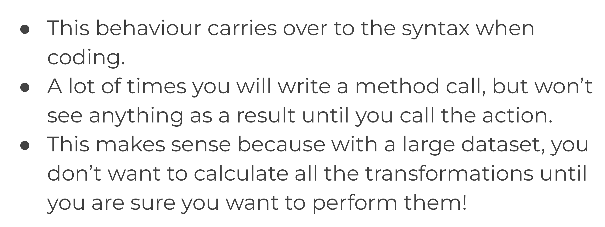
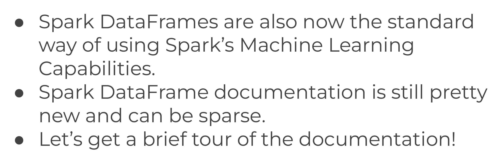
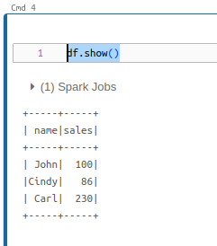

# 1-Intro-Setting

1. [What is Spark? Why Python?](#schema1)
2. [Databricks Setup](#schema2)
3. [Primera ejecución en Databricks](#schema3)

<hr>

<a name="schema1"></a>

## 1. What is Spark? Why Python?


### Local versus Distributed


### Big Data


### Hadoop


### Distributed Storage - HDFS


### MapReduce


### Big Data


### Spark


### Spark vs MapReduce


### Spark Rdds





### Spark DataFrames




<hr>

<a name="schema2"></a>
## 2. Databricks Setup

https://databricks.com/try-databricks

Y usar la Comunity Edition y seguir los pasos.

<hr>

<a name="schema3"></a>
## 3. Primera ejecución en Databricks

```
import pyspark
df = sqlContext.sql('SELECT * FROM mytable')

df.show() # similar al print()

```




